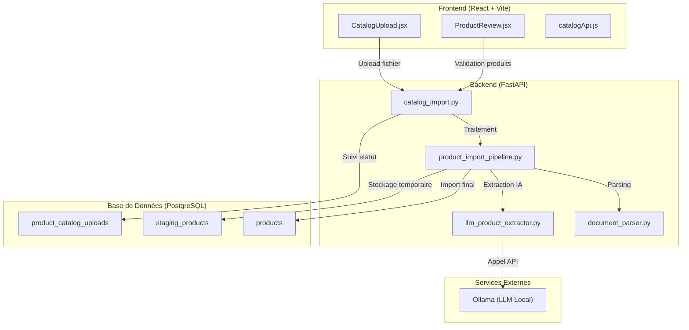

# Rapport : Système d'Extraction de Produits par IA

## Vue d'ensemble

Ce document détaille l'implémentation du système d'extraction de produits par Intelligence Artificielle (IA) pour la plateforme HelioSmart. Ce système permet aux vendeurs (vendors) d'importer des catalogues de produits via des fichiers (PDF, CSV, Excel) et d'utiliser un modèle de langage local (Ollama) pour extraire automatiquement les informations des produits.

---

## Architecture du Système



---

## Fichiers Créés

### 1. Backend - Services

#### [`HelioSmart/backend/app/services/document_parser.py`](HelioSmart/backend/app/services/document_parser.py:1)
- **Description**: Service de parsing de documents pour extraire le texte brut des catalogues
- **Fonctionnalités**:
  - Support des fichiers PDF (via `pdfplumber`)
  - Support des fichiers CSV (via `pandas`)
  - Support des fichiers Excel XLSX/XLS (via `pandas`)
- **Classes principales**:
  - `ParsedDocument`: Dataclass représentant un document parsé
  - `DocumentParser`: Classe principale avec méthodes `parse_pdf()`, `parse_csv()`, `parse_excel()`

#### [`HelioSmart/backend/app/services/llm_product_extractor.py`](HelioSmart/backend/app/services/llm_product_extractor.py:1)
- **Description**: Service d'extraction de produits utilisant Ollama (LLM local)
- **Fonctionnalités**:
  - Communication avec l'API Ollama locale
  - Prompt engineering pour l'extraction structurée
  - Parsing et validation des réponses JSON
  - Calcul de confiance pour chaque produit extrait
- **Classes principales**:
  - `ExtractedProduct`: Dataclass représentant un produit extrait
  - `LLMProductExtractor`: Classe principale avec méthode `extract_products()`
  - `get_product_extractor()`: Singleton pour l'instance extracteur
- **Modèle LLM utilisé**: `deepseek-coder:6.7b-instruct`

#### [`HelioSmart/backend/app/services/product_import_pipeline.py`](HelioSmart/backend/app/services/product_import_pipeline.py:1)
- **Description**: Pipeline complet d'importation de produits
- **Fonctionnalités**:
  - Orchestration du flux: Upload → Parsing → Extraction → Validation → Import
  - Gestion des statuts et progression
  - Stockage temporaire dans `staging_products`
  - Import final dans la table `products`
- **Classes principales**:
  - `ProductImportPipeline`: Classe principale avec méthodes:
    - `process_upload()`: Traite un upload complet
    - `store_extracted_products()`: Stocke les produits extraits
    - `update_upload_status()`: Met à jour le statut
    - `validate_staging_products()`: Valide les produits
    - `import_to_products()`: Importe les produits approuvés

### 2. Backend - API

#### [`HelioSmart/backend/app/api/catalog_import.py`](HelioSmart/backend/app/api/catalog_import.py:1)
- **Description**: Endpoints API REST pour l'importation de catalogues
- **Routes**:
  | Méthode | Route | Description |
  |---------|-------|-------------|
  | POST | `/catalog/upload` | Upload d'un fichier catalogue |
  | POST | `/catalog/{id}/extract` | Lancer l'extraction IA |
  | GET | `/catalog/{id}/status` | Obtenir le statut d'extraction |
  | GET | `/catalog/{id}/products` | Lister les produits extraits |
  | PUT | `/catalog/products/{id}` | Modifier un produit en attente |
  | POST | `/catalog/products/validate` | Approuver/Rejeter des produits |
  | POST | `/catalog/products/import` | Importer les produits approuvés |
  | GET | `/catalog/uploads` | Lister tous les uploads |
  | GET | `/catalog/ollama/status` | Vérifier le statut d'Ollama |

### 3. Frontend - Services

#### [`HelioSmart/frontend/src/services/catalogApi.js`](HelioSmart/frontend/src/services/catalogApi.js:1)
- **Description**: Client API pour communiquer avec le backend
- **Fonctionnalités**:
  - `uploadCatalog()`: Upload de fichier avec FormData
  - `extractProducts()`: Lancer l'extraction
  - `getStatus()`: Obtenir le statut
  - `getProducts()`: Récupérer les produits extraits
  - `updateProduct()`: Modifier un produit
  - `validateProducts()`: Valider des produits
  - `importProducts()`: Importer les produits
  - `getUploads()`: Lister les uploads
  - `checkOllamaStatus()`: Vérifier Ollama

### 4. Frontend - Composants

#### [`HelioSmart/frontend/src/components/CatalogUpload.jsx`](HelioSmart/frontend/src/components/CatalogUpload.jsx:1)
- **Description**: Composant de drag-and-drop pour l'upload de fichiers
- **Fonctionnalités**:
  - Zone de drag-and-drop avec feedback visuel
  - Barre de progression d'upload
  - Support des formats PDF, CSV, XLSX, XLS
  - Affichage du statut d'extraction en temps réel
  - Gestion des erreurs

#### [`HelioSmart/frontend/src/components/ProductReview.jsx`](HelioSmart/frontend/src/components/ProductReview.jsx:1)
- **Description**: Interface de révision et validation des produits extraits
- **Fonctionnalités**:
  - Tableau des produits extraits avec métadonnées
  - Indicateur de confiance d'extraction
  - Actions Approuver/Rejeter par produit
  - Actions en masse
  - Import final des produits approuvés

#### [`HelioSmart/frontend/src/pages/VendorCatalogImport.jsx`](HelioSmart/frontend/src/pages/VendorCatalogImport.jsx:1)
- **Description**: Page principale regroupant upload et révision
- **Fonctionnalités**:
  - Workflow en deux étapes (Upload → Révision)
  - Affichage de la progression
  - Historique des uploads

### 5. Base de Données - Modèles

#### Modifications dans [`HelioSmart/backend/app/models/user.py`](HelioSmart/backend/app/models/user.py:1)

**Enums ajoutés**:
```python
class ExtractionStatus(str, enum.Enum):
    PENDING = "pending"
    PROCESSING = "processing"
    EXTRACTING = "extracting"
    REVIEW = "review"
    COMPLETED = "completed"
    FAILED = "failed"

class StagingProductStatus(str, enum.Enum):
    PENDING = "pending"
    APPROVED = "approved"
    REJECTED = "rejected"
    MODIFIED = "modified"
```

**Modèles SQLAlchemy ajoutés**:

- **`ProductCatalogUpload`** (ligne 216): Suivi des uploads et extraction
  - `id`, `vendor_id`, `document_name`, `document_type`
  - `file_path`, `file_size`
  - `status` (VARCHAR), `progress_percentage`
  - `extracted_products_count`, `validated_products_count`, `imported_products_count`
  - `error_message`, `created_at`, `processed_at`, `completed_at`

- **`StagingProduct`** (ligne 252): Stockage temporaire des produits extraits
  - `id`, `upload_id`, `vendor_id`
  - `name`, `sku`, `brand`, `model`, `category`, `subcategory`
  - `description`, `specifications` (JSON)
  - `price`, `currency`, `unit`
  - `stock_quantity`, `availability_status`
  - `warranty_years`, `warranty_description`
  - `image_urls` (JSON), `datasheet_url`
  - `extraction_confidence`, `source_page`, `raw_extraction_data` (JSON)
  - `status` (VARCHAR), `vendor_notes`
  - `imported_product_id`, `created_at`, `updated_at`

---

## Fichiers Modifiés

### 1. Backend

#### [`HelioSmart/backend/app/api/__init__.py`](HelioSmart/backend/app/api/__init__.py:1)
- **Modification**: Ajout de l'import et inclusion du router `catalog_import`
```python
from .catalog_import import router as catalog_import_router
api_router.include_router(catalog_import_router)
```

#### [`HelioSmart/backend/app/models/user.py`](HelioSmart/backend/app/models/user.py:1)
- **Modifications**:
  - Relations ajoutées au modèle `Vendor`:
    ```python
    catalog_uploads = relationship("ProductCatalogUpload", ...)
    staging_products = relationship("StagingProduct", ...)
    ```
  - Changement des colonnes `status` de `SQLEnum` à `String(20)` pour éviter les problèmes de compatibilité PostgreSQL

### 2. Frontend

#### [`HelioSmart/frontend/src/App.jsx`](HelioSmart/frontend/src/App.jsx:1)
- **Modification**: Ajout de la route pour la page d'importation
```jsx
<Route path="/vendor/catalog-import" element={<VendorCatalogImport />} />
```

#### [`HelioSmart/frontend/src/components/Layout.jsx`](HelioSmart/frontend/src/components/Layout.jsx:1)
- **Modification**: Ajout du lien de navigation vers l'importation de catalogues dans le menu vendor

---

## Flux de Données

### 1. Upload et Extraction

```
1. Vendor upload un fichier (PDF/CSV/XLSX)
   → POST /catalog/upload
   → Stockage physique dans uploads/product_catalogs/
   → Création enregistrement ProductCatalogUpload (status: pending)

2. Vendor lance l'extraction
   → POST /catalog/{id}/extract
   → Parsing du document (DocumentParser)
   → Extraction IA (LLMProductExtractor via Ollama)
   → Stockage dans staging_products (status: pending)
   → Mise à jour ProductCatalogUpload (status: review)
```

### 2. Validation et Import

```
3. Vendor consulte les produits extraits
   → GET /catalog/{id}/products
   → Retourne liste des StagingProduct avec métadonnées

4. Vendor valide les produits
   → POST /catalog/products/validate
   → Mise à jour status: approved/rejected

5. Vendor importe les produits approuvés
   → POST /catalog/products/import
   → Création enregistrements dans table products
   → Mise à jour staging_products (status: approved + imported_product_id)
   → Mise à jour ProductCatalogUpload (status: completed)
```

---

## Configuration Requise

### Variables d'Environnement

Ajouter dans `HelioSmart/backend/.env`:
```bash
# Ollama Configuration
OLLAMA_HOST=http://host.docker.internal:11434
OLLAMA_MODEL=deepseek-coder:6.7b-instruct
```

### Dépendances Python (ajoutées)

