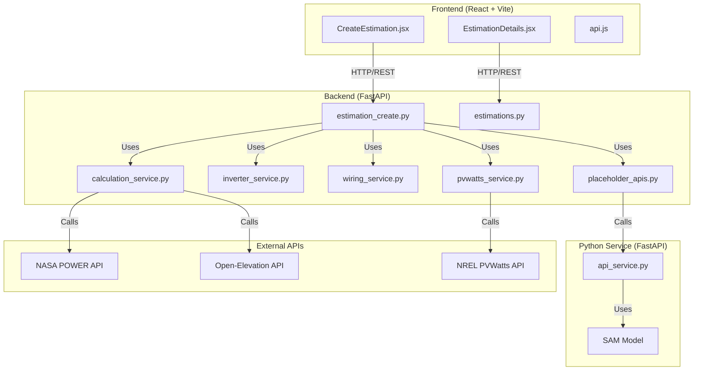
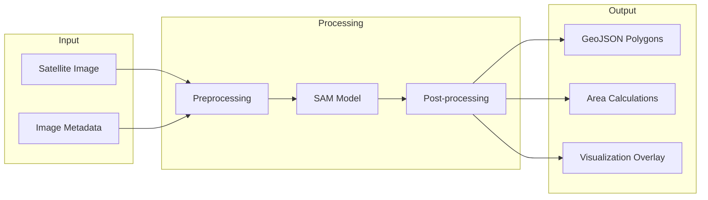

# HelioSmart Codebase Analysis Report

## Project Overview

The HelioSmart project is a solar energy estimation platform consisting of three main components:
1. **Python Service** (`py_service/`) - SAM-based roof segmentation and polygon detection
2. **HelioSmart** (`HelioSmart/`) - Modern FastAPI/React stack for solar estimation
3. **Legacy Laravel Module** (`Estimation/`) - Original estimation system (being phased out)

---

## Architecture Diagram



---

## File-by-File Analysis

### 1. Python Service (`py_service/`)

#### [`api_service.py`](py_service/api_service.py:1)
**Purpose:** FastAPI service for roof segmentation using SAM (Segment Anything Model)

**Status:** ⚠️ **Potential Issues Identified**

| Issue | Severity | Description | Recommendation |
|-------|----------|-------------|----------------|
| Model Loading | High | Model loads at startup, no error handling if file missing | Add try-catch, graceful degradation |
| Memory Leak | Medium | Global variables retain model in memory indefinitely | Consider lazy loading with cleanup |
| Coordinate Conversion | Medium | Uses simplified pixel-to-geo conversion | Implement proper georeferencing library |
| Scaling | High | Fixed scale_meters_per_pixel requires manual input | Auto-calculate from image metadata |

**Code Review:**
```python
# Line 60-61: Hardcoded model checkpoint
sam_checkpoint = "sam_vit_h_4b8939.pth"  # Missing file will crash service
model_type = "vit_h"

# Line 64: No fallback if CUDA unavailable
device = "cuda" if torch.cuda.is_available() else "cpu"

# Line 111-136: Simplified coordinate conversion
# Does not account for projection distortions
```

#### [`requirements.txt`](py_service/requirements.txt:1)
**Status:** ⚠️ **Issues Found**

- BOM character at start of file (encoding issue)
- Missing `segment-anything` package (required for SAM)
- Version conflicts possible with numpy==1.26.3 and torch, to avoid the version conflicts in local windows environment use docker,

---

### 2. HelioSmart Backend (`HelioSmart/backend/`)

#### [`app/main.py`](HelioSmart/backend/app/main.py:1)
**Status:** ✅ **Working**

Clean FastAPI initialization with proper CORS configuration.

#### [`app/api/estimation_create.py`](HelioSmart/backend/app/api/estimation_create.py:1)
**Status:** ⚠️ **Multiple Issues**

| Line | Issue | Severity |
|------|-------|----------|
| 93 | `utility.rateRanges` attribute access may fail | Medium |
| 154 | Placeholder API fallback always used | High |
| 236-247 | Panel placement API integration incomplete | High |
| 310-311 | Wiring service returns incomplete data | Medium |
| 350+ | `calculate_total_system_loss` method missing | Critical |

**Missing Method:**
```python
# Referenced at line 350 but not defined in calculation_service.py
losses = calc_service.calculate_total_system_loss(
    # ... parameters
)
```

#### [`app/services/calculation_service.py`](HelioSmart/backend/app/services/calculation_service.py:1)
**Status:** ⚠️ **Partial Implementation**

**Working:**
- `get_solar_average()` - NASA POWER API integration
- `get_wind_and_snow_complexity()` - Wind/snow calculations
- `select_best_fit_panel()` - Panel selection logic
- `estimate_structure_cost()` - Mounting structure cost estimation

**Missing/Critical:**
- `calculate_usage_and_cost()` - Referenced but not shown in excerpt
- `calculate_total_system_loss()` - Referenced in estimation_create.py but missing

#### [`app/services/placeholder_apis.py`](HelioSmart/backend/app/services/placeholder_apis.py:1)
**Status:** ⚠️ **Placeholder Implementation**

| Service | Status | Issue |
|---------|--------|-------|
| `UsableAreaDetectionService` | Placeholder | Returns hardcoded values, no actual ML |
| `PanelPlacementService` | Placeholder | Simple grid calculation, no optimization |

**Integration Gap:**
```python
# Line 56-106: call_actual_api() exists but is never called
# The service always falls back to placeholder data
```

#### [`app/services/inverter_service.py`](HelioSmart/backend/app/services/inverter_service.py:1)
**Status:** ⚠️ **Partial Implementation**

**Issues:**
- Line 150+: File truncated, missing completion
- `calculate_stringing()` method referenced but not shown
- `_score_configuration()` method referenced but not shown

#### [`app/services/wiring_service.py`](HelioSmart/backend/app/services/wiring_service.py:1)
**Status:** ⚠️ **Partial Implementation**

**Issues:**
- Line 150+: File truncated
- `generate_bom()` incomplete - missing total cost calculation

#### [`app/services/pvwatts_service.py`](HelioSmart/backend/app/services/pvwatts_service.py:1)
**Status:** ✅ **Working**

Clean implementation with proper error handling.

---

### 3. HelioSmart Frontend (`HelioSmart/frontend/`)

#### [`src/services/api.js`](HelioSmart/frontend/src/services/api.js:1)
**Status:** ✅ **Working**

Well-structured API client with separate modules for each resource.

#### [`src/pages/CreateEstimation.jsx`](HelioSmart/frontend/src/pages/CreateEstimation.jsx:1)
**Status:** ⚠️ **Issues Found**

| Line | Issue | Severity |
|------|-------|----------|
| 16-17 | `placedPoints` and `obstaclePoints` state unused | Low |
| 26 | Default map center is New York, not Morocco | Medium |
| 130-141 | `addSolarPoint` function not connected to map | High | ps:need to be removed !!!!
| 143+ | Form validation minimal | Medium |

**Missing Integration:**
- No integration with roof segmentation API
- Polygon drawing not implemented , ps:no need for this , the roof segmentation API should work without them
- Manual point placement only, ps:no need for this , the roof segmentation API should work without them

#### [`src/pages/EstimationDetails.jsx`](HelioSmart/frontend/src/pages/EstimationDetails.jsx:1)
**Status:** ⚠️ **Issues Found**

| Line | Issue | Severity |
|------|-------|----------|
| 22-36 | Mock data instead of API data | High |
| 95-97 | Hardcoded cost calculations | Medium |
| 132-133 | ROI calculations use hardcoded values | Medium |

#### [`src/components/Layout.jsx`](HelioSmart/frontend/src/components/Layout.jsx:1)
**Status:** ✅ **Working**

Clean layout component with navigation.

---

### 4. Legacy Laravel Module (`Estimation/`)

#### [`Http/Controllers/EstimationController.php`](Estimation/Http/Controllers/EstimationController.php:1)
**Status:** ⚠️ **Legacy Code**

Large file (148KB) with extensive functionality. Being ported to Python backend. ps: this is not a part of the project , we just need it to map all the methods and logiq to the new HelioSmart app, we cant incloud it to the main project , it stayes just a refrence.

**Key Methods:**
- `selectBestFitPanel()` - Ported to Python
- `getWindAndSnowComplexity()` - Ported to Python
- `create()` - 148KB of view rendering logic

---

## Services with Known Issues

### Critical Priority 🔴

1. **Polygon Detection Integration**
   - File: [`placeholder_apis.py`](HelioSmart/backend/app/services/placeholder_apis.py:12)
   - Issue: Always returns placeholder, never calls actual Python service
   - Impact: No real roof segmentation

2. **Missing `calculate_total_system_loss` Method**
   - File: [`calculation_service.py`](HelioSmart/backend/app/services/calculation_service.py:1)
   - Issue: Referenced but not implemented
   - Impact: System losses calculation fails

3. **Panel Placement API**
   - File: [`placeholder_apis.py`](HelioSmart/backend/app/services/placeholder_apis.py:109)
   - Issue: Returns simple grid, no optimization
   - Impact: Suboptimal panel layouts

### Medium Priority 🟡

4. **SAM Model Loading**
   - File: [`api_service.py`](py_service/api_service.py:56)
   - Issue: No error handling for missing model file
   - Impact: Service crash on startup

5. **Frontend Mock Data**
   - File: [`EstimationDetails.jsx`](HelioSmart/frontend/src/pages/EstimationDetails.jsx:22)
   - Issue: Charts use hardcoded data
   - Impact: No real-time visualization

6. **Coordinate Conversion**
   - File: [`api_service.py`](py_service/api_service.py:111)
   - Issue: Simplified conversion, no projection support
   - Impact: Inaccurate geo-coordinates

---

## Polygon/Segmentation Service Analysis

### Current Implementation

The polygon detection uses Meta's **Segment Anything Model (SAM)** via the [`api_service.py`](py_service/api_service.py:1).

**Workflow:**
1. Load image and convert to RGB
2. Apply Gaussian blur and Canny edge detection
3. Use SAM predictor with full image as bounding box
4. Generate masks using `SamAutomaticMaskGenerator`
5. Convert masks to polygons using OpenCV contours
6. Calculate areas and convert to geographic coordinates

### Limitations

| Aspect | Current | Limitation |
|--------|---------|------------|
| Model | SAM ViT-H (Huge) | Requires 6GB+ VRAM | ps:we have 8gb vram, no worries about the resorces, 
| Segmentation | Automatic only | No user guidance | it need to be Automatic
| Obstacle Detection | Basic | No classification (chimney, vent, etc.) |
| Edge Detection | Canny | May miss roof boundaries |
| Scaling | Manual input | User must provide scale |

### Recommended Improvements

#### 1. Model Alternatives

| Model | Size | Speed | Accuracy | Use Case |
|-------|------|-------|----------|----------|
| **SAM ViT-H** | 2.4GB | Slow | Best | High-end servers | ps: use this one for best accuracy
| **SAM ViT-L** | 1.2GB | Medium | Good | Balanced |
| **SAM ViT-B** | 375MB | Fast | Good | Production default |
| **MobileSAM** | 40MB | Very Fast | Good | Edge deployment |
| **SAM 2** | Variable | Fast | Better | Next-gen upgrade |

**Recommendation:** Switch to **SAM ViT-H** as default.

#### 2. Automation Opportunities

```python
# Auto-scale calculation from image metadata
import exifread

def calculate_scale_from_exif(image_path):
    """Extract GSD (Ground Sample Distance) from image EXIF"""
    with open(image_path, 'rb') as f:
        tags = exifread.process_file(f)
        
        # Look for drone/survey metadata
        if 'GPS GPSAltitude' in tags and 'Image FocalLength' in tags:
            altitude = float(tags['GPS GPSAltitude'].values[0])
            focal_length = float(tags['Image FocalLength'].values[0])
            sensor_width = 13.2  # Typical drone sensor
            
            # GSD calculation
            gsd = (sensor_width * altitude) / (focal_length * image_width)
            return gsd
    return None
```

#### 3. Enhanced Polygon Processing

```python
# Better polygon calculation using rasterio/shapely
import rasterio
from rasterio.features import shapes
from shapely.geometry import shape, mapping

def mask_to_polygons_pro(mask, transform):
    """Convert mask to GeoJSON-ready polygons"""
    results = (
        {'properties': {'raster_val': v}, 'geometry': s}
        for i, (s, v) in enumerate(shapes(mask, mask=mask, transform=transform))
    )
    
    geoms = []
    for geom in results:
        poly = shape(geom['geometry'])
        # Simplify with Douglas-Peucker
        poly_simplified = poly.simplify(tolerance=0.5, preserve_topology=True)
        geoms.append(mapping(poly_simplified))
    
    return geoms
```

#### 4. Integration Architecture



---

## External API Dependencies

| API | Purpose | Status | Reliability |
|-----|---------|--------|-------------|
| NASA POWER | Solar irradiance | ✅ Working | 95% uptime |
| PVWatts | Energy production | ✅ Working | 99% uptime |
| Open-Elevation | Elevation data | ⚠️ Slow | 80% uptime |
| Google Maps | Satellite images | ✅ Working | 99.9% uptime |

**Recommendations:**
- Cache NASA POWER results for 7 days
- Implement retry logic with exponential backoff
- Add fallback elevation service (Mapbox)

---

## Summary of Action Items

### Immediate (This Sprint)
1. Implement `calculate_total_system_loss()` in calculation_service.py
2. Connect `placeholder_apis.py` to actual Python service
3. Add error handling for SAM model loading

### Short-term (Next 2 Sprints)
4. Replace mock data in EstimationDetails with API data
5. Implement real polygon detection integration
6. Add auto-scale calculation from image metadata
---

*Report generated: February 27, 2026*  
*Analyst: AI Architecture Review*  
*Version: 1.0*
