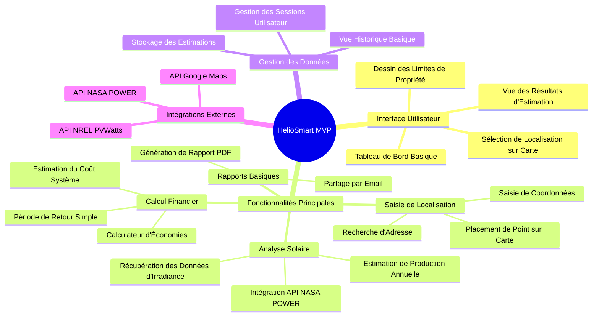
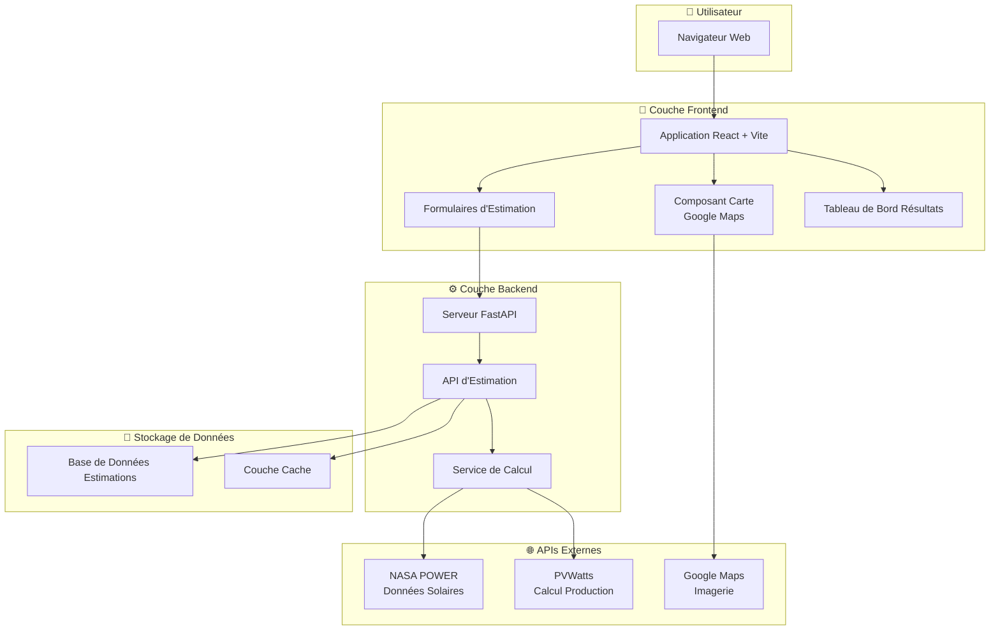
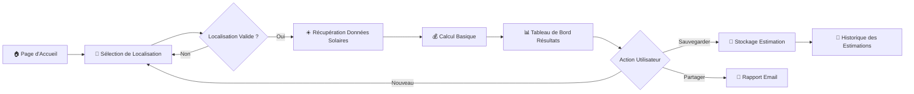
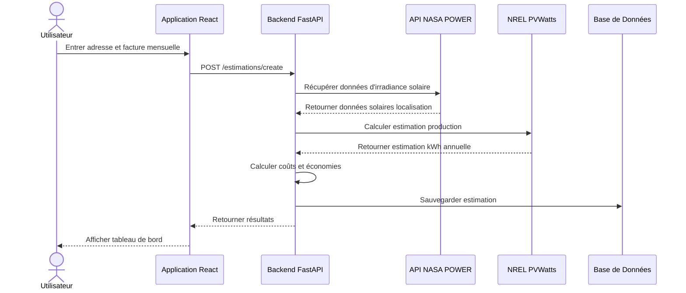
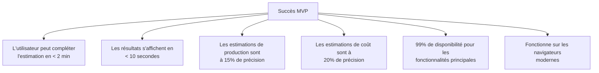

# HelioSmart MVP - Carte Mentale et Schéma

## Vue d'Ensemble

Ce document visualise le Produit Minimum Viable (MVP) pour HelioSmart, en se concentrant sur les fonctionnalités principales nécessaires pour la sortie initiale.

---

## Carte Mentale des Fonctionnalités MVP



---

## Schéma d'Architecture MVP



---

## Flux Utilisateur MVP



---

## Détail des Composants Principaux MVP

### 1. Composants Frontend

```
┌─────────────────────────────────────────────────────────────┐
│                    FRONTEND MVP                             │
├─────────────────────────────────────────────────────────────┤
│                                                             │
│  ┌─────────────────┐  ┌─────────────────┐                   │
│  │   Vue Carte     │  │ Formulaire      │                   │
│  │  ┌───────────┐  │  │  ┌───────────┐  │                   │
│  │  │  Google   │  │  │  │ Recherche │  │                   │
│  │  │  Maps     │  │  │  │ Adresse   │  │                   │
│  │  │  Widget   │  │  │  └───────────┘  │                   │
│  │  └───────────┘  │  │  ┌───────────┐  │                   │
│  │  • Placement    │  │  │ Facture   │  │                   │
│  │    de Point     │  │  │ Mensuelle$│  │                   │
│  │  • Zoom/Pan     │  │  └───────────┘  │                   │
│  │  • Vue          │  │  ┌───────────┐  │                   │
│  │    Satellite    │  │  │ Surface   │  │                   │
│  │                 │  │  │ Toit (opt)│  │                   │
│  │                 │  │  └───────────┘  │                   │
│  └─────────────────┘  └─────────────────┘                   │
│                                                             │
│  ┌─────────────────────────────────────┐                    │
│  │         Tableau de Bord Résultats   │                    │
│  │  ┌─────────┐ ┌─────────┐ ┌────────┐ │                    │
│  │  │ kWh     │ │ Coût    │ │Économies│ │                    │
│  │  │ Annuel  │ │ Système │ │Mensuelles│                    │
│  │  └─────────┘ └─────────┘ └────────┘ │                    │
│  │  ┌─────────┐ ┌─────────┐            │                    │
│  │  │ Période │ │Économies│            │                    │
│  │  │ Retour  │ │ 25 Ans  │            │                    │
│  │  └─────────┘ └─────────┘            │                    │
│  └─────────────────────────────────────┘                    │
│                                                             │
└─────────────────────────────────────────────────────────────┘
```

### 2. Services Backend

```
┌─────────────────────────────────────────────────────────────┐
│                    BACKEND MVP                              │
├─────────────────────────────────────────────────────────────┤
│                                                             │
│  ┌─────────────────────────────────────────────────────┐    │
│  │              Couche API (FastAPI)                   │    │
│  ├─────────────────────────────────────────────────────┤    │
│  │  POST /api/estimations/create                       │    │
│  │  GET  /api/estimations/{id}                         │    │
│  │  GET  /api/estimations/                             │    │
│  └─────────────────────────────────────────────────────┘    │
│                                                             │
│  ┌─────────────────────────────────────────────────────┐    │
│  │           Service de Calcul                         │    │
│  ├─────────────────────────────────────────────────────┤    │
│  │  ┌──────────────┐    ┌──────────────┐               │    │
│  │  │ Intégration  │    │ Intégration  │               │    │
│  │  │ NASA POWER   │───▶│ PVWatts      │               │    │
│  │  │              │    │              │               │    │
│  │  │ • Irradiance │    │ • Estimation │               │    │
│  │  │   Solaire    │    │   Production │               │    │
│  │  │ • Données    │    │ • Calcul     │               │    │
│  │  │   Météo      │    │   Efficacité │               │    │
│  │  └──────────────┘    └──────────────┘               │    │
│  └─────────────────────────────────────────────────────┘    │
│                                                             │
│  ┌─────────────────────────────────────────────────────┐    │
│  │           Calculateur Financier                     │    │
│  ├─────────────────────────────────────────────────────┤    │
│  │  • Coût Système = $/Watt × Taille Système           │    │
│  │  • Économies Annuelles = kWh × Tarif Électricité    │    │
│  │  • Retour = Coût Total ÷ Économies Annuelles        │    │
│  │  • ROI = (Économies Vie - Coût) ÷ Coût              │    │
│  └─────────────────────────────────────────────────────┘    │
│                                                             │
└─────────────────────────────────────────────────────────────┘
```

---

## Flux de Données MVP



---

## Périmètre MVP : Inclus vs Exclus

in the @/HelioSmart  i want you to step by step analyze each file the code base , undertand our project , and than  cerate a system of authentification , that will have 4 users , guest , user, vendor , and enginner , and a service and a  fornt end dahsboard for vendors, that will have a palce where the vedor uploads a documants  , that document will be ijected into an llm which will return a json file that will list the products in that documants , and once the vendor approve it , it will inserted in our databse, and add a page that list the vendors that we have , and show their porduct from the databse, and don't touch the mltistep form functionalities bc its important , dont change in them just add to the fornt end , and the routes  

### ✅ Dans le Périmètre (MVP)

| Fonctionnalité | Priorité | Description |
|----------------|----------|-------------|
| Sélection de Localisation | P0 | Recherche d'adresse + placement de point |
| Récupération Données Solaires | P0 | Intégration API NASA POWER |
| Estimation de Production | P0 | Calcul basique PVWatts |
| Calculateur de Coût | P0 | Tarification simple basée $/Watt |
| Projection d'Économies | P0 | Économies mensuelles/annuelles |
| Tableau de Bord Résultats | P0 | Vue résultats claire et simple |
| Stockage des Estimations | P1 | Sauvegarde en base de données |
| Vue Historique | P1 | Liste des estimations passées |
| Rapport PDF | P1 | Génération de rapport basique |

### ❌ Hors Périmètre (Post-MVP)

| Fonctionnalité | Future Version |
|----------------|----------------|
| Segmentation AI de Toit | v2.0 |
| Dessin de Polygones | v2.0 |
| Optimisation Placement Panneaux | v2.0 |
| Sélection d'Onduleur | v2.0 |
| Schémas de Câblage | v2.0 |
| Visualisation 3D | v2.5 |
| Comptes Utilisateurs/Auth | v2.0 |
| Support Multi-langue | v2.0 |
| Application Mobile | v3.0 |
| Réseau d'Installateurs | v2.5 |

---

## Stack Technique MVP

```
┌─────────────────────────────────────────────────────────────┐
│                   STACK TECHNIQUE                           │
├─────────────────────────────────────────────────────────────┤
│                                                             │
│  Frontend                    Backend                        │
│  ├─ React 18                 ├─ FastAPI                     │
│  ├─ Vite                     ├─ Python 3.11                 │
│  ├─ React Router             ├─ SQLAlchemy                  │
│  ├─ Axios                    ├─ Pydantic                    │
│  └─ Google Maps JS API       └─ SQLite (MVP) / PostgreSQL   │
│                                                             │
│  APIs Externes                                              │
│  ├─ API NASA POWER                                          │
│  ├─ API NREL PVWatts                                        │
│  └─ Google Maps Platform                                    │
│                                                             │
└─────────────────────────────────────────────────────────────┘
```

---

## Critères de Succès MVP



---

*Version du Document : 1.0*  
*Dernière Mise à Jour : Février 2026*  
*Pour la planification de développement et le cadrage des sprints*
