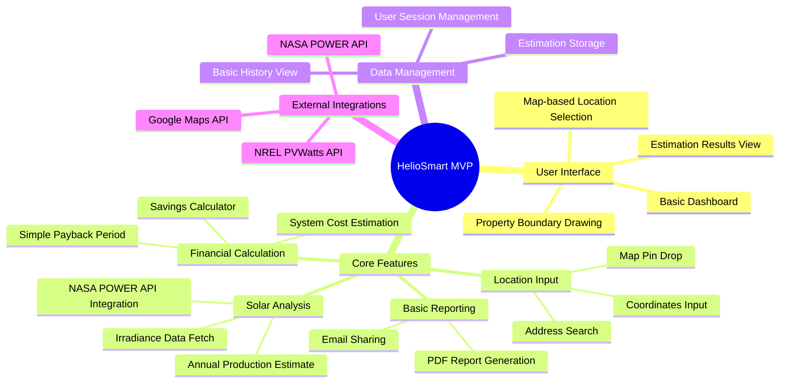
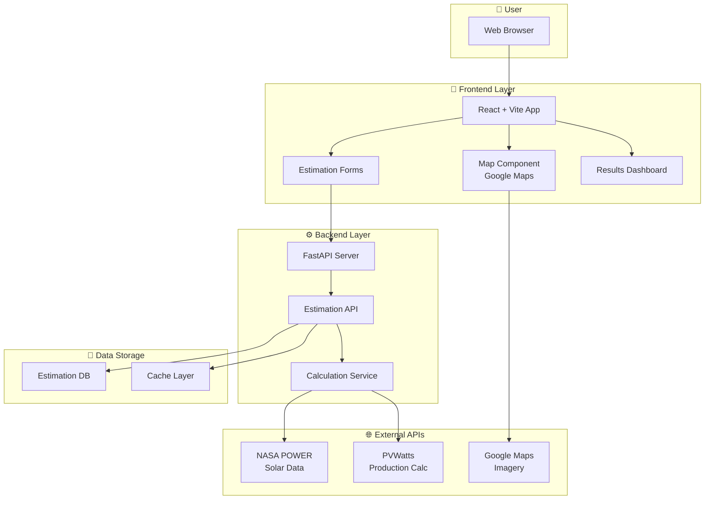
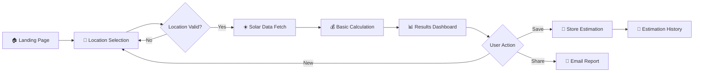
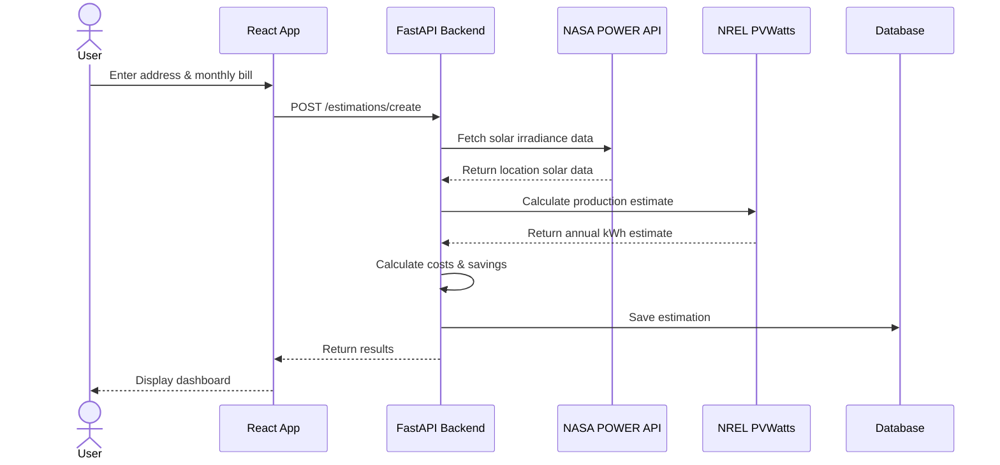
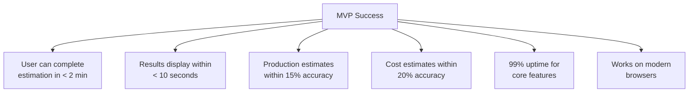

# HelioSmart MVP - Mindmap & Schema

## Overview

This document visualizes the Minimum Viable Product for HelioSmart, focusing on the core features needed for the initial release.

---

## MVP Feature Mindmap



---

## MVP Architecture Schema



---

## MVP User Flow



---

## MVP Core Components Breakdown

### 1. Frontend Components

```
┌─────────────────────────────────────────────────────────────┐
│                    FRONTEND MVP                             │
├─────────────────────────────────────────────────────────────┤
│                                                             │
│  ┌─────────────────┐  ┌─────────────────┐                   │
│  │   Map View      │  │  Input Form     │                   │
│  │  ┌───────────┐  │  │  ┌───────────┐  │                   │
│  │  │  Google   │  │  │  │ Address   │  │                   │
│  │  │  Maps     │  │  │  │ Search    │  │                   │
│  │  │  Widget   │  │  │  └───────────┘  │                   │
│  │  └───────────┘  │  │  ┌───────────┐  │                   │
│  │  • Pin Drop     │  │  │ Monthly   │  │                   │
│  │  • Zoom/Pan     │  │  │ Bill $    │  │                   │
│  │  • Satellite    │  │  └───────────┘  │                   │
│  │    View         │  │  ┌───────────┐  │                   │
│  │                 │  │  │ Roof Area │  │                   │
│  │                 │  │  │ (optional)│  │                   │
│  │                 │  │  └───────────┘  │                   │
│  └─────────────────┘  └─────────────────┘                   │
│                                                             │
│  ┌─────────────────────────────────────┐                    │
│  │         Results Dashboard           │                    │
│  │  ┌─────────┐ ┌─────────┐ ┌────────┐ │                    │
│  │  │ Annual  │ │ System  │ │ Monthly│ │                    │
│  │  │ kWh     │ │ Cost    │ │ Savings│ │                    │
│  │  └─────────┘ └─────────┘ └────────┘ │                    │
│  │  ┌─────────┐ ┌─────────┐            │                    │
│  │  │ Payback │ │ 25-Year │            │                    │
│  │  │ Period  │ │ Savings │            │                    │
│  │  └─────────┘ └─────────┘            │                    │
│  └─────────────────────────────────────┘                    │
│                                                             │
└─────────────────────────────────────────────────────────────┘
```

### 2. Backend Services

```
┌─────────────────────────────────────────────────────────────┐
│                    BACKEND MVP                              │
├─────────────────────────────────────────────────────────────┤
│                                                             │
│  ┌─────────────────────────────────────────────────────┐    │
│  │              API Layer (FastAPI)                    │    │
│  ├─────────────────────────────────────────────────────┤    │
│  │  POST /api/estimations/create                       │    │
│  │  GET  /api/estimations/{id}                         │    │
│  │  GET  /api/estimations/                             │    │
│  └─────────────────────────────────────────────────────┘    │
│                                                             │
│  ┌─────────────────────────────────────────────────────┐    │
│  │           Calculation Service                       │    │
│  ├─────────────────────────────────────────────────────┤    │
│  │  ┌──────────────┐    ┌──────────────┐               │    │
│  │  │ NASA POWER   │    │ PVWatts      │               │    │
│  │  │ Integration  │───▶│ Integration  │               │    │
│  │  │              │    │              │               │    │
│  │  │ • Solar      │    │ • Production │               │    │
│  │  │   Irradiance │    │   Estimate   │               │    │
│  │  │ • Weather    │    │ • Efficiency │               │    │
│  │  │   Data       │    │   Calc       │               │    │
│  │  └──────────────┘    └──────────────┘               │    │
│  └─────────────────────────────────────────────────────┘    │
│                                                             │
│  ┌─────────────────────────────────────────────────────┐    │
│  │           Financial Calculator                      │    │
│  ├─────────────────────────────────────────────────────┤    │
│  │  • System Cost = $/Watt × System Size               │    │
│  │  • Annual Savings = kWh × Electricity Rate          │    │
│  │  • Payback = Total Cost ÷ Annual Savings            │    │
│  │  • ROI = (Lifetime Savings - Cost) ÷ Cost           │    │
│  └─────────────────────────────────────────────────────┘    │
│                                                             │
└─────────────────────────────────────────────────────────────┘
```

---

## MVP Data Flow



---

## MVP Scope: In vs Out

### ✅ IN Scope (MVP)

| Feature | Priority | Description |
|---------|----------|-------------|
| Location Selection | P0 | Address search + map pin drop |
| Solar Data Fetch | P0 | NASA POWER API integration |
| Production Estimate | P0 | Basic PVWatts calculation |
| Cost Calculator | P0 | Simple $/Watt-based pricing |
| Savings Projection | P0 | Monthly/annual savings |
| Results Dashboard | P0 | Clean, simple results view |
| Estimation Storage | P1 | Save to database |
| History View | P1 | List past estimations |
| PDF Report | P1 | Basic report generation |

### ❌ OUT of Scope (Post-MVP)

| Feature | Future Release |
|---------|----------------|
| AI Roof Segmentation | v2.0 |
| Polygon Drawing | v2.0 |
| Panel Placement Optimization | v2.0 |
| Inverter Selection | v2.0 |
| Wiring Diagrams | v2.0 |
| 3D Visualization | v2.5 |
| User Accounts/Auth | v2.0 |
| Multi-language Support | v2.0 |
| Mobile App | v3.0 |
| Installer Network | v2.5 |

---

## MVP Technical Stack

```
┌─────────────────────────────────────────────────────────────┐
│                   TECH STACK                                │
├─────────────────────────────────────────────────────────────┤
│                                                             │
│  Frontend                    Backend                        │
│  ├─ React 18                 ├─ FastAPI                     │
│  ├─ Vite                     ├─ Python 3.11                 │
│  ├─ React Router             ├─ SQLAlchemy                  │
│  ├─ Axios                    ├─ Pydantic                    │
│  └─ Google Maps JS API       └─ SQLite (MVP) / PostgreSQL   │
│                                                             │
│  External APIs                                              │
│  ├─ NASA POWER API                                          │
│  ├─ NREL PVWatts API                                        │
│  └─ Google Maps Platform                                    │
│                                                             │
└─────────────────────────────────────────────────────────────┘
```

---

## MVP Success Criteria



---

*Document Version: 1.0*  
*Last Updated: February 2026*  
*For development planning and sprint scoping*
