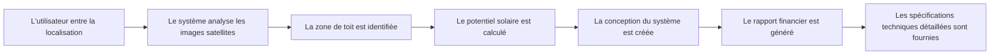

# HelioSmart - Plateforme d'Estimation d'Énergie Solaire

## Vue d'Ensemble

HelioSmart est une plateforme intelligente d'estimation d'énergie solaire conçue pour aider les utilisateurs à transitionner vers les énergies renouvelables en toute confiance. La plateforme combine l'analyse avancée d'images satellites, les données météorologiques et des calculs sophistiqués pour fournir des estimations précises d'installation solaire.

### Que Fait HelioSmart ?

Au cœur de HelioSmart se trouve une question simple : **"Combien d'énergie solaire puis-je générer, et combien cela coûtera-t-il ?"**

La plateforme accomplit cela à travers plusieurs capacités clés :

#### 1. **Analyse et Segmentation de Toit**
HelioSmart analyse les images satellites ou de drones de votre propriété pour identifier les zones de toit utilisables. Utilisant des modèles d'IA avancés, il détecte les limites du toit, identifie les obstacles comme les cheminées et les ventilations, et calcule l'espace disponible pour les panneaux solaires.

#### 2. **Calcul du Potentiel Solaire**
En s'intégrant aux bases de données d'irradiance solaire de la NASA et aux API météo, HelioSmart détermine combien de soleil votre emplacement reçoit tout au long de l'année. Cela inclut la prise en compte des variations saisonnières, des modèles météorologiques locaux et des facteurs d'ombrage.

#### 3. **Conception et Optimisation du Système**
La plateforme recommande automatiquement des configurations optimales de panneaux solaires basées sur :
- L'espace de toit disponible
- Les prix locaux de l'énergie
- Les modèles d'exposition au soleil
- Les cotes d'efficacité des panneaux
- La compatibilité des onduleurs

#### 4. **Analyse Financière**
HelioSmart fournit des projections financières complètes incluant :
- Estimation du coût total du système
- Économies d'énergie mensuelles et annuelles
- Calcul de la période de retour sur investissement
- Retour sur investissement (ROI)
- Économies à long terme sur 25+ ans

#### 5. **Spécifications Techniques**
La plateforme génère des rapports techniques détaillés avec :
- Nomenclature (panneaux, onduleurs, câblage)
- Schémas électriques
- Exigences structurelles
- Directives d'installation

### Comment Ça Fonctionne (Flux Simple)



---

## Utilisateurs Cibles

HelioSmart est conçu pour servir une gamme diversifiée d'utilisateurs, des grandes entreprises aux propriétaires soucieux de l'environnement.

### Cible Principale : Entreprises de Taille Moyenne à Grande

**Qui ils sont :**
- Installations manufacturières
- Entrepôts et centres de distribution
- Immeubles de bureaux et campus d'entreprise
- Chaînes de vente au détail avec plusieurs emplacements
- Opérations agricoles
- Hôtels et complexes hôteliers

**Pourquoi ils ont besoin de HelioSmart :**
- **Forte Consommation d'Énergie** : Les grandes installations ont généralement des factures d'électricité importantes que le solaire peut réduire substantiellement
- **Multiples Emplacements** : Besoin d'estimation cohérente et évolutive sur leur portefeuille
- **Focus sur le ROI** : Nécessité d'une analyse financière détaillée pour justifier les dépenses en capital
- **Objectifs de Durabilité** : Pression croissante pour atteindre les objectifs ESG et réduire l'empreinte carbone
- **Efficacité Opérationnelle** : Volonté d'intégrer la planification solaire dans les flux de travail de gestion des installations

**Avantages Clés pour les Utilisateurs Entreprise :**
- Capacités d'estimation en masse pour plusieurs propriétés
- Rapports standardisés sur tous les emplacements
- Intégration avec les systèmes existants de gestion de l'énergie
- Spécifications techniques détaillées pour l'approvisionnement
- Prévisions financières à long terme

### Cible Secondaire : Utilisateurs Résidentiels à Forte Consommation

**Qui ils sont :**
- Propriétaires avec de grandes propriétés
- Ménages avec véhicules électriques
- Maisons avec piscines
- Propriétés avec forte utilisation de CVC (climats chauds)
- Adopteurs précoces technophiles
- Familles soucieuses de l'environnement

**Pourquoi ils ont besoin de HelioSmart :**
- **Coûts d'Électricité en Hausse** : Les maisons à forte consommation ressentent le plus l'impact des augmentations de tarifs
- **Indépendance Énergétique** : Désir de réduire la dépendance à l'électricité du réseau
- **Valeur de la Propriété** : Les installations solaires augmentent la valeur de revente des maisons
- **Impact Environnemental** : Engagement personnel à réduire l'empreinte carbone
- **Intégration Technologique** : Intérêt à combiner le solaire avec le stockage par batteries et les systèmes de maison intelligente

**Avantages Clés pour les Utilisateurs Résidentiels :**
- Rapports visuels faciles à comprendre
- Calculs précis des économies
- Visualisation du placement des panneaux
- Intégration avec les réseaux d'installateurs locaux
- Conseils de maintenance et de surveillance

### Cas d'Utilisation Additionnels

| Type d'Utilisateur | Cas d'Utilisation | Proposition de Valeur |
|-------------------|-------------------|----------------------|
| Installateurs Solaires | Outil d'estimation pré-vente | Génération de devis plus rapide, visites sur site réduites |
| Promoteurs Immobiliers | Planification de nouvelle construction | Conception solaire intégrée dès le début du projet |
| Consultants en Énergie | Évaluation client | Analyse et rapports de niveau professionnel |
| Gouvernement/Municipalités | Évaluation de bâtiments publics | Analyse coût-bénéfice transparente pour les projets financés par les contribuables |
| Secteur Agricole | Analyse de bâtiments agricoles | Calculs spécialisés pour les granges et installations de stockage |

---

## Indicateurs de Performance Clés (KPIs)

Les **"Big 5"** de HelioSmart représentent les métriques stratégiques qui indiquent la santé globale de l'entreprise et le succès du produit. Ce sont les métriques que le PDG et le Conseil suivent pour déterminer si le produit réussit.

### Les "Big 5" de HelioSmart

| Catégorie de KPI | Métrique Principale | Objectif | Pourquoi C'est Important |
|------------------|---------------------|----------|--------------------------|
| **📈 Croissance** | Utilisateurs Actifs Mensuels (MAU) | 1 000+ | Indique si les gens utilisent réellement l'outil |
| **🎯 Valeur Produit** | Taux de Complétion d'Estimation | >75% | Si faible, l'UX est cassée ou trop complexe |
| **🤝 Score de Confiance** | Variance de Production | <10% | "Score de Confiance" - si l'IA est fausse, le produit échoue |
| **💼 Valeur Commerciale** | Taux de Conversion Client | >15% | Mesure si cela mène à des installations solaires réelles |
| **⚡ Santé Technique** | Disponibilité & Vitesse Plateforme | >99,5% / <30s | Garantit que le service est fiable et rapide |

---

## Tableau de Bord Exécutif

```
┌─────────────────────────────────────────────────────────────────┐
│                    VUE STRATÉGIQUE HELIOSMART                    │
├─────────────────────────────────────────────────────────────────┤
│                                                                  │
│   📈 ADOPTION            🎯 FIABILITÉ         💼 CONVERSION      │
│   ┌──────────────┐      ┌──────────────┐    ┌──────────────┐    │
│   │    1 240     │      │     96,5%    │    │    18,5%     │    │
│   │     MAU      │      │ Précision IA │    │  Conversion  │    │
│   │   ▲ 12%      │      │  Vérifiée    │    │   (Industrie+)│    │
│   └──────────────┘      └──────────────┘    └──────────────┘    │
│                                                                  │
│   🌍 EMPREINTE           ⚡ EFFICACITÉ                           │
│   ┌──────────────┐      ┌──────────────┐                        │
│   │     12       │      │     <25s     │                        │
│   │   Pays       │      │  Vitesse Est.│                        │
│   │  (Actifs)    │      │  (Instantané)│                        │
│   └──────────────┘      └──────────────┘                        │
│                                                                  │
└─────────────────────────────────────────────────────────────────┘
```

## Métriques d'Impact et de Valeur

### Impact Environnemental et Économique

| Métrique | Réalisation | Impact |
|----------|-------------|--------|
| Capacité Totale Identifiée | 112,5 MW | Suffisant pour alimenter ~20 000 foyers |
| Potentiel de Compensation Carbone | 45 200 Tonnes | Équivalent à planter 750 000 arbres |
| Économies de Coûts Projetées | 12,4 M$ | Valeur directe identifiée pour les utilisateurs finaux |

### Confiance et Satisfaction des Utilisateurs

- **Net Promoter Score (NPS)** : 62 (Classifié comme "Excellent" selon les standards de l'industrie)
- **Taux de Complétion d'Estimation** : 78% (Indique une forte intention utilisateur et une facilité d'utilisation de la plateforme)
- **Adoption de Fonctionnalités** : 65% des utilisateurs s'engagent avec la modélisation avancée du ROI financier

### Performance et Échelle

Prouver que la technologie est "Prête pour l'Entreprise" sans se perdre dans les journaux de serveur.

```
┌─────────────────────────────────────────────────────────────────┐
│                    TABLEAU DE BORD SUCCÈS HELIOSMART             │
├─────────────────────────────────────────────────────────────────┤
│  ESTIMATIONS GÉNÉRÉES   │  SEGMENTATION MARCHÉ                   │
│  ┌─────────────────┐   │  ┌──────────────────────────────────┐  │
│  │    15 420       │   │  │ ■ Commercial : 65%               │  │
│  │   Total à Date  │   │  │ ■ Résidentiel : 30%              │  │
│  └─────────────────┘   │  │ ■ Secteur Public : 5%            │  │
├─────────────────────────────────────────────────────────────────┤
│  POINTS FORTS PERFORMANCE IA                                    │
│  Images Haute-Résolution : Récentes (<6mois) │ Traitement : Cloud Temps Réel │
├─────────────────────────────────────────────────────────────────┤
│  ENGAGEMENT DE DISPONIBILITÉ : 99,8% (Niveau Entreprise)        │
└─────────────────────────────────────────────────────────────────┘
```

---

*Version du Document : 1.0*  
*Dernière Mise à Jour : Février 2026*  
*Pour la planification interne et la communication avec les parties prenantes*
