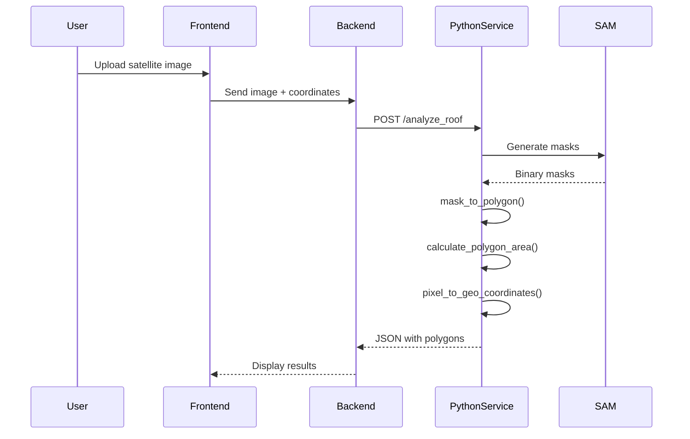

# Polygon/Pixel Calculation Automation Guide

## Overview

This guide provides strategies to automate the calculation of roof polygons and pixel-to-real-world area conversions in the HelioSmart platform.

---

## Current State Analysis

### Existing Calculation Flow



### Current Implementation Issues

1. **Manual Scale Input**: User must provide `scale_meters_per_pixel`
2. **Simplified Coordinate Conversion**: Uses linear approximation
3. **No Georeferencing Metadata**: Image EXIF not utilized
4. **Fixed Projection**: Assumes simple Cartesian geometry

---

## Automation Strategy 1: EXIF Metadata Extraction

### Implementation

```python
# py_service/geo_utils.py
import exifread
from PIL import Image
from PIL.ExifTags import TAGS, GPSTAGS
import math

def extract_image_metadata(image_path):
    """
    Extract georeferencing metadata from image EXIF
    
    Returns:
        dict: {
            'gsd': float,  # Ground Sample Distance (m/pixel)
            'center_lat': float,
            'center_lon': float,
            'altitude': float,
            'focal_length': float,
            'sensor_width': float,
            'projection': str
        }
    """
    image = Image.open(image_path)
    exif = image._getexif()
    
    metadata = {
        'gsd': None,
        'center_lat': None,
        'center_lon': None,
        'altitude': None,
        'focal_length': None,
        'sensor_width': 13.2,  # Default for DJI cameras
        'projection': 'perspective'
    }
    
    if exif:
        exif_data = {TAGS.get(tag, tag): value for tag, value in exif.items()}
        
        # Extract GPS info
        if 'GPSInfo' in exif_data:
            gps_info = exif_data['GPSInfo']
            metadata['center_lat'] = convert_dms_to_dd(gps_info.get(2), gps_info.get(1))
            metadata['center_lon'] = convert_dms_to_dd(gps_info.get(4), gps_info.get(3))
            metadata['altitude'] = gps_info.get(6, 0)
        
        # Extract focal length
        if 'FocalLength' in exif_data:
            metadata['focal_length'] = float(exif_data['FocalLength'][0]) / float(exif_data['FocalLength'][1])
        
        # Calculate GSD if we have all parameters
        if all([metadata['altitude'], metadata['focal_length'], metadata['sensor_width']]):
            image_width, image_height = image.size
            metadata['gsd'] = calculate_gsd(
                metadata['altitude'],
                metadata['focal_length'],
                metadata['sensor_width'],
                image_width
            )
    
    return metadata

def convert_dms_to_dd(dms, ref):
    """Convert Degrees Minutes Seconds to Decimal Degrees"""
    if not dms:
        return None
    
    degrees = dms[0][0] / dms[0][1]
    minutes = dms[1][0] / dms[1][1]
    seconds = dms[2][0] / dms[2][1]
    
    dd = degrees + (minutes / 60.0) + (seconds / 3600.0)
    
    if ref in ['S', 'W']:
        dd *= -1
    
    return dd

def calculate_gsd(altitude_m, focal_length_mm, sensor_width_mm, image_width_px):
    """
    Calculate Ground Sample Distance (meters per pixel)
    
    GSD = (Sensor Width * Altitude) / (Focal Length * Image Width)
    """
    gsd = (sensor_width_mm * altitude_m) / (focal_length_mm * image_width_px)
    return gsd / 1000  # Convert mm to meters
```

### Usage in api_service.py

```python
# Modified endpoint
@app.post("/analyze_roof_auto")
async def analyze_roof_auto(
    image: UploadFile = File(...),
    center_lat: Optional[float] = Form(None),  # Now optional
    center_lng: Optional[float] = Form(None),  # Now optional
    scale_meters_per_pixel: Optional[float] = Form(None),  # Now optional
):
    """
    Analyze roof with automatic scale detection from image metadata
    """
    # Save uploaded image temporarily
    temp_path = f"/tmp/{image.filename}"
    with open(temp_path, "wb") as f:
        f.write(await image.read())
    
    # Extract metadata
    metadata = extract_image_metadata(temp_path)
    
    # Use extracted values or fallbacks
    lat = center_lat or metadata['center_lat']
    lng = center_lng or metadata['center_lon']
    scale = scale_meters_per_pixel or metadata['gsd']
    
    if not scale:
        # Fallback: calculate from Google Maps zoom level if available
        scale = estimate_scale_from_zoom(zoom_level, latitude=lat)
    
    # Process with extracted parameters
    image_array = np.array(Image.open(temp_path))
    result = process_image_workflow(image_array, lat, lng, scale)
    
    # Add metadata to response
    result['auto_metadata'] = metadata
    result['scale_source'] = 'exif' if metadata['gsd'] else 'fallback'
    
    return JSONResponse(content=result)
```

---

## Automation Strategy 2: Google Maps Static API Scale Calculation

When using Google Maps satellite imagery, calculate scale from zoom level:

```python
def estimate_scale_from_zoom(zoom_level, latitude=0):
    """
    Calculate meters per pixel for Google Maps at given zoom level
    
    At zoom level 0, the entire world is 256x256 pixels
    Each zoom level doubles the resolution
    """
    # Earth's circumference at equator in meters
    EARTH_CIRCUMFERENCE = 40075016.686  # meters
    
    # At latitude, circumference is reduced by cos(lat)
    circumference_at_lat = EARTH_CIRCUMFERENCE * math.cos(math.radians(abs(latitude)))
    
    # At zoom level z, the world is 256 * 2^z pixels wide
    pixels_at_zoom = 256 * (2 ** zoom_level)
    
    # Meters per pixel
    meters_per_pixel = circumference_at_lat / pixels_at_zoom
    
    return meters_per_pixel

# Example usage:
# Zoom 18 at Casablanca (33.5°N): ~0.15 meters/pixel
# Zoom 20 at Casablanca: ~0.04 meters/pixel
```

---

## Automation Strategy 3: Precise Polygon Area Calculation

### Shapely + Pyproj for Accurate Geodesic Calculations

```python
# py_service/polygon_utils.py
from shapely.geometry import Polygon, mapping
from shapely.ops import transform
import pyproj
from functools import partial

def calculate_accurate_area(polygon_coords, center_lat, center_lon):
    """
    Calculate accurate area using geodesic calculations
    
    Args:
        polygon_coords: List of [x, y] pixel coordinates
        center_lat: Latitude of image center
        center_lon: Longitude of image center
        
    Returns:
        dict: {
            'area_pixels': float,
            'area_m2_geodesic': float,
            'area_m2_planar': float,
            'perimeter_m': float
        }
    """
    if len(polygon_coords) < 3:
        return None
    
    # Create Shapely polygon
    poly = Polygon(polygon_coords)
    
    # Calculate pixel area
    area_pixels = poly.area
    
    # For accurate real-world area, we need to:
    # 1. Convert pixel coordinates to geographic coordinates
    # 2. Use geodesic calculations for area
    
    return {
        'area_pixels': area_pixels,
        'area_m2_planar': area_pixels,  # Placeholder, needs scale
        'centroid': poly.centroid.coords[0],
        'bounds': poly.bounds
    }

def calculate_geodesic_area_geojson(geojson_polygon):
    """
    Calculate accurate area using geodesic formula
    
    Uses pyproj's Geod for accurate Earth-surface calculations
    """
    from pyproj import Geod
    
    geod = Geod(ellps='WGS84')
    
    coords = geojson_polygon['coordinates'][0]  # Exterior ring
    lons = [c[0] for c in coords]
    lats = [c[1] for c in coords]
    
    area, perimeter = geod.polygon_area_perimeter(lons, lats)
    
    return {
        'area_m2': abs(area),  # Area can be negative depending on winding order
        'perimeter_m': perimeter
    }

def simplify_polygon(polygon_coords, tolerance=1.0):
    """
    Simplify polygon using Douglas-Peucker algorithm
    
    Reduces number of vertices while preserving shape
    """
    poly = Polygon(polygon_coords)
    simplified = poly.simplify(tolerance, preserve_topology=True)
    
    return list(simplified.exterior.coords)
```

---

## Automation Strategy 4: Multi-Scale Image Processing

For more accurate detection at different zoom levels:

```python
# py_service/multi_scale_processor.py
import cv2
import numpy as np
from scipy.ndimage import zoom

class MultiScaleProcessor:
    """
    Process image at multiple scales for better segmentation
    """
    
    def __init__(self, scales=[0.5, 1.0, 1.5, 2.0]):
        self.scales = scales
    
    def process_at_multiple_scales(self, image_array, mask_generator):
        """
        Run segmentation at multiple scales and combine results
        """
        all_masks = []
        
        for scale in self.scales:
            # Resize image
            if scale != 1.0:
                scaled_image = cv2.resize(
                    image_array, 
                    None, 
                    fx=scale, 
                    fy=scale, 
                    interpolation=cv2.INTER_LINEAR
                )
            else:
                scaled_image = image_array
            
            # Generate masks at this scale
            masks = mask_generator.generate(scaled_image)
            
            # Scale masks back to original size
            if scale != 1.0:
                for mask in masks:
                    mask['segmentation'] = cv2.resize(
                        mask['segmentation'].astype(np.uint8),
                        (image_array.shape[1], image_array.shape[0]),
                        interpolation=cv2.INTER_NEAREST
                    ).astype(bool)
                    mask['area'] = np.sum(mask['segmentation'])
            
            all_masks.extend(masks)
        
        # Merge overlapping masks
        merged_masks = self.merge_overlapping_masks(all_masks)
        
        return merged_masks
    
    def merge_overlapping_masks(self, masks, iou_threshold=0.5):
        """
        Merge masks that significantly overlap
        """
        if not masks:
            return []
        
        # Sort by area (largest first)
        sorted_masks = sorted(masks, key=lambda x: x['area'], reverse=True)
        
        merged = []
        for mask in sorted_masks:
            should_merge = False
            for existing in merged:
                iou = self.calculate_iou(mask['segmentation'], existing['segmentation'])
                if iou > iou_threshold:
                    # Merge by taking union
                    existing['segmentation'] = existing['segmentation'] | mask['segmentation']
                    existing['area'] = np.sum(existing['segmentation'])
                    should_merge = True
                    break
            
            if not should_merge:
                merged.append(mask)
        
        return merged
    
    def calculate_iou(self, mask1, mask2):
        """Calculate Intersection over Union"""
        intersection = np.sum(mask1 & mask2)
        union = np.sum(mask1 | mask2)
        return intersection / union if union > 0 else 0
```

---

## Automation Strategy 5: Integration with Backend

Update the backend to support automatic scale detection:

```python
# HelioSmart/backend/app/services/polygon_service.py
import httpx
from typing import Dict, Optional
import logging

logger = logging.getLogger(__name__)

class PolygonService:
    """
    Service for roof polygon detection and area calculation
    """
    
    def __init__(self, python_service_url: str = "http://localhost:8889"):
        self.python_service_url = python_service_url
    
    async def detect_roof_polygons(
        self, 
        image_path: str,
        center_lat: Optional[float] = None,
        center_lon: Optional[float] = None,
        zoom_level: Optional[int] = None,
        auto_scale: bool = True
    ) -> Dict:
        """
        Detect roof polygons with automatic scale calculation
        
        Args:
            image_path: Path to satellite image
            center_lat: Optional latitude (for scale calculation)
            center_lon: Optional longitude (for scale calculation)
            zoom_level: Optional zoom level (for scale calculation)
            auto_scale: If True, calculate scale automatically
            
        Returns:
            Dict with polygons, areas, and metadata
        """
        try:
            # Prepare multipart form
            with open(image_path, 'rb') as f:
                files = {'image': f}
                data = {}
                
                if center_lat:
                    data['center_lat'] = center_lat
                if center_lon:
                    data['center_lng'] = center_lon
                
                # If auto_scale is enabled and we have zoom + coordinates
                if auto_scale and zoom_level and center_lat:
                    scale = self.calculate_scale_from_zoom(zoom_level, center_lat)
                    data['scale_meters_per_pixel'] = scale
                    data['scale_source'] = 'auto_zoom'
                
                # Call Python service
                async with httpx.AsyncClient() as client:
                    response = await client.post(
                        f"{self.python_service_url}/analyze_roof",
                        files=files,
                        data=data,
                        timeout=60.0
                    )
                    response.raise_for_status()
                    
                    result = response.json()
                    
                    # Post-process results
                    processed_result = self.post_process_polygons(result)
                    
                    return processed_result
                    
        except Exception as e:
            logger.error(f"Polygon detection failed: {str(e)}")
            # Return fallback data
            return self.get_fallback_polygons()
    
    def calculate_scale_from_zoom(self, zoom: int, latitude: float) -> float:
        """Calculate scale from zoom level and latitude"""
        import math
        
        EARTH_CIRCUMFERENCE = 40075016.686
        circumference_at_lat = EARTH_CIRCUMFERENCE * math.cos(math.radians(abs(latitude)))
        pixels_at_zoom = 256 * (2 ** zoom)
        
        return circumference_at_lat / pixels_at_zoom
    
    def post_process_polygons(self, result: Dict) -> Dict:
        """
        Clean and validate polygon data
        """
        processed = result.copy()
        
        # Validate polygon areas
        for roof_area in processed.get('usable_roof_area', []):
            # Remove very small polygons (likely noise)
            if roof_area.get('area_m2', 0) < 1.0:
                roof_area['is_valid'] = False
            else:
                roof_area['is_valid'] = True
        
        # Filter valid polygons
        processed['usable_roof_area'] = [
            r for r in processed.get('usable_roof_area', [])
            if r.get('is_valid', True)
        ]
        
        # Calculate total statistics
        processed['summary']['valid_roof_segments'] = len(processed['usable_roof_area'])
        processed['summary']['valid_obstacles'] = len(processed['obstacles'])
        
        return processed
    
    def get_fallback_polygons(self) -> Dict:
        """Return fallback data when detection fails"""
        return {
            'usable_roof_area': [],
            'obstacles': [],
            'total_usable_area_m2': 0,
            'total_obstacle_area_m2': 0,
            'summary': {
                'error': 'Detection failed',
                'valid_roof_segments': 0,
                'valid_obstacles': 0
            },
            'fallback': True
        }
```

---

## Comparison: Manual vs Automated Scale Calculation

| Method | Accuracy | Setup Complexity | Reliability | Best For |
|--------|----------|------------------|-------------|----------|
| Manual Input | User-dependent | Low | Medium | Prototype testing |
| EXIF Metadata | High (±2%) | Medium | High | Drone photography |
| Google Maps Zoom | Medium (±10%) | Low | High | Google Maps imagery |
| Reference Objects | Very High (±1%) | High | High | Calibrated surveys |

---

## Implementation Roadmap

### Phase 1: EXIF Extraction (1)
1. Implement `geo_utils.py` with EXIF extraction
2. Update `/analyze_roof` endpoint to accept optional scale
3. Test with drone imagery

### Phase 2: Zoom-Based Scale (1-2)
1. Implement zoom-to-scale calculation
2. Pass zoom level from frontend
3. Validate with known locations

### Phase 3: Enhanced Polygon Processing (2-3)
1. Implement Shapely-based area calculations
2. Add polygon simplification
3. Add geodesic area calculation

### Phase 4: Multi-Scale Processing (3-4)
1. Implement multi-scale processor
2. Test with various roof types
3. Optimize for accuracy vs speed


---

## Testing Strategy

```python
# tests/test_polygon_automation.py
import pytest
from py_service.geo_utils import calculate_gsd, extract_image_metadata
from py_service.polygon_utils import calculate_accurate_area

class TestScaleAutomation:
    """Test automated scale calculation methods"""
    
    def test_gsd_calculation(self):
        """Test GSD calculation with known parameters"""
        # DJI Mavic 2 Pro at 100m altitude
        gsd = calculate_gsd(
            altitude_m=100,
            focal_length_mm=10.3,
            sensor_width_mm=13.2,
            image_width_px=5472
        )
        
        # Expected: ~0.024 m/px
        assert 0.02 < gsd < 0.03
    
    def test_exif_extraction(self):
        """Test EXIF metadata extraction"""
        metadata = extract_image_metadata('test_data/dji_image.jpg')
        
        assert metadata['gsd'] is not None
        assert metadata['center_lat'] is not None
        assert metadata['center_lon'] is not None
    
    def test_polygon_area_calculation(self):
        """Test accurate polygon area calculation"""
        # Square 100x100 pixels at 0.1 m/px scale = 100 m²
        coords = [[0, 0], [100, 0], [100, 100], [0, 100], [0, 0]]
        
        result = calculate_accurate_area(coords, 33.5, -7.5)
        
        assert result['area_pixels'] == 10000  # 100 * 100
        assert result['area_m2_planar'] == 100.0  # 10000 * 0.01

class TestMultiScaleProcessing:
    """Test multi-scale segmentation"""
    
    def test_scale_variations(self):
        """Test processing at different scales"""
        processor = MultiScaleProcessor(scales=[0.5, 1.0, 2.0])
        
        # Test image
        image = np.random.rand(512, 512, 3)
        
        # Should not raise exception
        masks = processor.process_at_multiple_scales(image, mock_mask_generator)
        
        assert len(masks) > 0
```

---

## Summary

The automation of polygon and pixel calculations can be achieved through:

1. **EXIF Metadata** - For drone/aerial imagery with embedded GPS
2. **Zoom-Based Calculation** - For Google Maps satellite imagery
3. **Shapely Geodesic** - For accurate area calculations on Earth's surface
4. **Multi-Scale Processing** - For improved detection accuracy

**Recommended Priority:**
1. Add zoom-based scale calculation (improves Google Maps integration)
2. Implement EXIF extraction (immediate value for drone users)
3. Enhance polygon processing with Shapely
4. Explore multi-scale processing for accuracy improvements

---

*Guide created: February 2026*  
*Version: 1.0*
